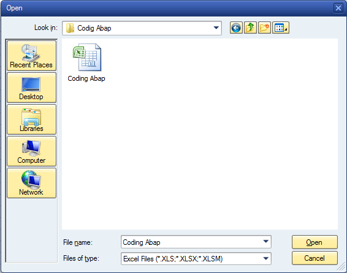

Do you remember the exact string to set a file filter in ABAP file chooser? I don't, but class `cl_gui_frontend_services` has some nice predefined class atributes

---

```abap
FILETYPE_ALL = 'All Files (*.*)|*.*|'
FILETYPE_EXCEL = 'Microsoft Excel Files (*.XLS;*.XLSX;*.XLSM)|*.XLS;*.XLSX;*.XLSM|'
FILETYPE_WORD = 'Microsoft Word Files (*.DOC;*.DOCX;*.DOCM)|*.DOC;*.DOCX;*.DOCM|'
FILETYPE_TEXT = 'Text Files (*.TXT)|*.TXT|'
FILETYPE_HTML = 'HTML files (*.HTML, *.HTM)|*.HTML;*.HTM|'
FILETYPE_RTF = 'RTF Files (*.RTF)|*.RTF|'
FILETYPE_XML = 'XML (*.XML)|*.XML|'
FILETYPE_POWERPOINT = 'Microsoft PowerPoint Files (*PPT;*.PPTX;*.PPTM)|*PPT;*.PPTX;*.PPTM|'
```

Usage example

```abap
cl_gui_frontend_services=>file_open_dialog(
  EXPORTING
    file_filter             =  cl_gui_frontend_services=>FILETYPE_EXCEL
    multiselection          =  space
  CHANGING
    file_table              =  lt_files
    rc                      =  lv_subrc
    user_action             =  lv_user_action
  EXCEPTIONS
    file_open_dialog_failed = 1
    cntl_error              = 2
    error_no_gui            = 3
    not_supported_by_gui    = 4
    OTHERS                  = 5 ).
```

Extra point for supporting multiple file extensions


