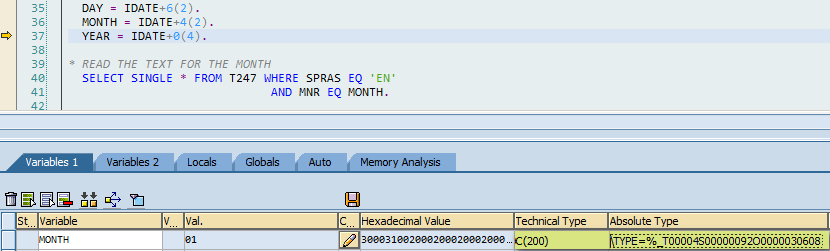

Loose typing and work with output parameters in function/method inner logic may be fatal

---


#The Story

I was looking for a function to get month's name from a date and I found `HR_IN_GET_DATE_COMPONENTS`.


In test mode it looked good and I wrote something like this:

```abap
    CALL FUNCTION 'HR_IN_GET_DATE_COMPONENTS'
      EXPORTING
        idate                         = `20150101` 
      IMPORTING
        ltext                         = lv_month_name
      EXCEPTIONS
        input_date_is_initial         = 1
        text_for_month_not_maintained = 2.
```

> `sy-subrc = 2`

Oh, oh! In test mode I got 'January', but now I get a `text_for_month_not_maintained` exception.


#Error \* Error \* Error = Success

I've debugged the code and found something weird


Problems:

1. `MONTH` is defined as `REFERENCE(MONTH) TYPE  C` in function header, without lenght, but in line 36 is used as a lenght 2 char.
2. Use exporting params as working variables
3. But the worst thing, related to problem #1, is that the type of the exporting params changes depending on which parameters are assigned 

Call the function with all export params fixed the problem

```abap
    CALL FUNCTION 'HR_IN_GET_DATE_COMPONENTS'
      EXPORTING
        idate                         = `20150101` 
      IMPORTING
        day                           = lv_day 
        month                         = lv_month
        year                          = lv_year 
        ltext                         = lv_month_name
      EXCEPTIONS
        input_date_is_initial         = 1
        text_for_month_not_maintained = 2.
```

> `January`

Here, there are the same problems, but `MONTH` is supplied and now its type is `CHAR2`, so everything is OK


 

#Epiologue

* Don't be lazy, proper typing is mandatory
  * If you try to avoid unnecesary casting before function/method calls you can loose typing but you MUST cast ASAP to a typed variable.
* Don't trust function test mode
  * In test mode, system is calling conversion routines under the hood
  * In test mode, all params are supplied and params type may be "not obvious" 
* Using paramas as working variables may be harmful
  * Clear exporting params ASAP
  * Use local variables instead params for inner logic.
  Proper typing may mitigate this, but think in params as initial/final state and bind intermediate states (inner logic) to local variables.
  In case of error or unexpected behavior, it's safer maintain output params unpolluted